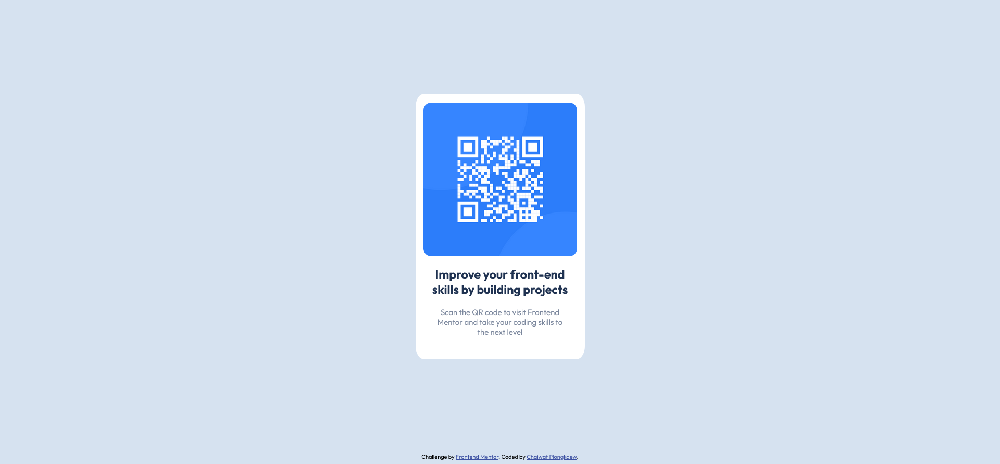

# Frontend Mentor - QR code component solution

This is a solution to the QR code component challenge on Frontend Mentor.

## Table of contents

- [Frontend Mentor - QR code component solution](#frontend-mentor---qr-code-component-solution)
  - [Table of contents](#table-of-contents)
  - [Overview](#overview)
    - [Screenshot](#screenshot)
  - [Links](#links)
  - [My process](#my-process)
    - [Built with](#built-with)
    - [What I learned](#what-i-learned)
    - [Continued development](#continued-development)
    - [Useful resources](#useful-resources)
  - [Author](#author)

## Overview

### Screenshot

Desktop-view:



Mobile-view:


## Links

-Solution URL: https://github.com/pluemmoo/qr-code-component-main.git

-Live Site URL: https://qr-code-component-main-gamma-two.vercel.app/

## My process

### Built with

- Semantic HTML5 markup
- CSS custom properties
- SCSS
- Mobile-first workflow

### What I learned

I have learned how to center the image by using margin and text-align

```html
<div class="container">
    
</div> 
```

```scss
.container {
    margin: 18rem auto ;
    background-color: white;
    height: 51rem;
    width: 325px;
    text-align: center;
    border-radius: 5%;


    img {
        margin-block: 1.7rem ;
        width: 29.5rem;
        border-radius: 5%;
    }
}
```

### Continued development

In the future, I want to take a look on flex-box and grid in css.

### Useful resources

- https://www.w3schools.com/howto/howto_css_image_center.asp - this give me an idea for centering image by using margin and padding.

## Author

- Website - [Chaiwat Plongkaew](https://pluemmoo.github.io)
- Frontend Mentor - [@pluemmoo](https://www.frontendmentor.io/profile/pluemmoo)

